# Unified Real-Time Trip Updaters Design Document

## Overview

This document describes the refactoring of the SIRI-ET and GTFS-RT real-time trip updaters in OpenTripPlanner to share common logic for applying updates to the transit model.

## Problem Statement

OTP supports real-time trip updates from two feed formats:
- **SIRI-ET** (Service Interface for Real-time Information - Estimated Timetable)
- **GTFS-RT** (General Transit Feed Specification - Realtime)

Both updaters implement the same use cases:
- Updating arrival/departure times for existing trips
- Cancelling trips
- Adding new trips not in the schedule
- Modifying stop patterns (skipping stops, adding stops)

Previously, each updater had its own implementation for applying these updates to the transit model, leading to:
- Duplicated logic
- Inconsistent behavior between formats
- Higher maintenance burden
- Harder to add new features consistently

## Solution

Split each updater into two sub-components:

1. **Parser** (format-specific): Parses real-time messages and converts them to a common model
2. **Applier** (shared): Applies the common model changes to the transit model via a four-stage pipeline

```
┌─────────────────────────────────────────────────────────────────────────────┐
│                           Real-Time Update Flow                              │
└─────────────────────────────────────────────────────────────────────────────┘

                SIRI-ET Feed                           GTFS-RT Feed
                     │                                      │
                     ▼                                      ▼
          ┌──────────────────┐                   ┌──────────────────┐
          │  SiriETUpdater   │                   │PollingTripUpdater│
          │  (entry point)   │                   │  (entry point)   │
          └────────┬─────────┘                   └────────┬─────────┘
                   │                                      │
                   ▼                                      ▼
          ┌──────────────────┐                   ┌──────────────────┐
          │SiriTripUpdate    │                   │GtfsRtTripUpdate  │
          │    Parser        │                   │    Parser        │
          │(format-specific) │                   │(format-specific) │
          └────────┬─────────┘                   └────────┬─────────┘
                   │                                      │
                   │      ParsedTripUpdate                │
                   │      (common model)                  │
                   │                                      │
                   └──────────────┬───────────────────────┘
                                  │
                                  ▼
                   ┌──────────────────────────┐
                   │  DefaultTripUpdateApplier │
                   │    (pipeline stages)      │
                   │                           │
                   │  1. Pattern match on type │
                   │  2. Resolve references    │
                   │  3. Validate preconditions│
                   │  4. Handle mutation        │
                   └────────────┬──────────────┘
                                │
                                ▼
                      ┌──────────────────┐
                      │ TripUpdateResult │
                      │(RealTimeTripUpdate│
                      │  + warnings)     │
                      └────────┬─────────┘
                               │
                               ▼
                      ┌──────────────────┐
                      │TimetableSnapshot │
                      │    Manager       │
                      └──────────────────┘
```

### Real-Time Update Flow (Mermaid)

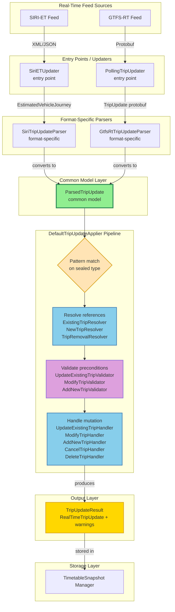

## Pipeline Architecture

The core of the unified updater is a **four-stage pipeline** inside `DefaultTripUpdateApplier`. Each real-time message goes through these stages sequentially: **Parse → Resolve → Validate → Handle**. The first stage (Parse) is format-specific; the remaining three stages are shared between both SIRI-ET and GTFS-RT.

### Pipeline Overview Diagram

```mermaid
flowchart LR
    subgraph "Stage 1: Parse"
        direction TB
        MSG[Feed Message]
        PARSER[TripUpdateParser]
        PTU[ParsedTripUpdate]
        MSG --> PARSER --> PTU
    end

    subgraph "Stage 2: Resolve"
        direction TB
        RES[Resolver]
        RESOLVED[ResolvedExistingTrip<br/>ResolvedNewTrip<br/>ResolvedTripRemoval]
        RES --> RESOLVED
    end

    subgraph "Stage 3: Validate"
        direction TB
        VAL[Validator]
        CHECK[success / error]
        VAL --> CHECK
    end

    subgraph "Stage 4: Handle"
        direction TB
        HAND[Handler]
        RESULT[TripUpdateResult]
        HAND --> RESULT
    end

    PTU --> RES
    RESOLVED --> VAL
    CHECK --> HAND

    style PTU fill:#90EE90,stroke:#2E8B57,stroke-width:2px
    style RESOLVED fill:#87CEEB,stroke:#4682B4,stroke-width:2px
    style RESULT fill:#FFD700,stroke:#DAA520,stroke-width:2px
```

### Stage 1: Parse (Format-Specific)

**Responsibility:** Convert a format-specific message into the common `ParsedTripUpdate` model.

**Classes:**
- `TripUpdateParser<T>` — generic interface
- `SiriTripUpdateParser` — implements `TripUpdateParser<EstimatedVehicleJourney>`
- `GtfsRtTripUpdateParser` — implements `TripUpdateParser<GtfsRealtime.TripUpdate>`

Each parser extracts trip identification, stop time updates, creation info (for new trips), and format-appropriate `TripUpdateOptions` from the feed message. The parser is the only component that knows about the wire format; everything downstream operates on the common model.

### Stage 2: Resolve (Shared)

**Responsibility:** Resolve symbolic references in the `ParsedTripUpdate` into concrete domain objects (Trip, TripPattern, StopLocation, service date, TripTimes).

Different update types need different resolved data, so there are three resolvers:

| Resolver | Used for | Output |
|----------|----------|--------|
| `ExistingTripResolver` | `UPDATE_EXISTING`, `MODIFY_TRIP` | `ResolvedExistingTrip` |
| `NewTripResolver` | `ADD_NEW_TRIP` | `ResolvedNewTrip` |
| `TripRemovalResolver` | `CANCEL_TRIP`, `DELETE_TRIP` | `ResolvedTripRemoval` |

Each resolver composes lower-level resolvers:

- **`ServiceDateResolver`** — resolves the service date from an explicit date, a `TripOnServiceDate` lookup, or deferred calculation from `aimedDepartureTime` (handling overnight trips)
- **`TripResolver`** — resolves a `Trip` from a `TripReference` by trying direct trip ID lookup, then `TripOnServiceDate` ID lookup
- **`StopResolver`** — resolves a `StopLocation` from a `StopReference` by trying assigned stop ID, scheduled stop point mapping, or direct lookup
- **`FuzzyTripMatcher`** — optional fallback when exact trip lookup fails (controlled by the `fuzzyTripMatching` config parameter)

### Resolver Composition Diagram

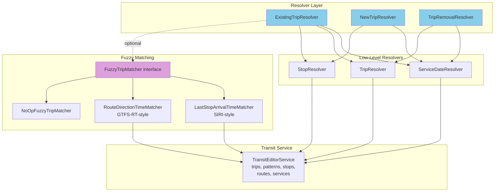

### Stage 3: Validate (Shared)

**Responsibility:** Check preconditions on the resolved data before any mutation begins. Validators are pure checks that return either success or an error — they never modify state.

| Validator | Used for | Checks |
|-----------|----------|--------|
| `UpdateExistingTripValidator` | `UPDATE_EXISTING` | FULL_UPDATE: no stop sequences, exact stop count match. PARTIAL_UPDATE: always passes. |
| `ModifyTripValidator` | `MODIFY_TRIP` | Minimum 2 stops. SIRI extra calls: non-extra stop count matches original, each non-extra stop matches via `StopReplacementValidator`. |
| `AddNewTripValidator` | `ADD_NEW_TRIP` | New trips only (skips for updates to existing added trips). FAIL mode: all stops known. Minimum 2 stops. |

Cancel and delete operations have no validator — the resolver provides enough guarantee.

### Stage 4: Handle (Shared)

**Responsibility:** Apply the actual mutations — create or update TripTimes, build TripPatterns, set RealTimeState, and produce a `TripUpdateResult` containing the `RealTimeTripUpdate`.

| Handler | Used for | Operation |
|---------|----------|-----------|
| `UpdateExistingTripHandler` | `UPDATE_EXISTING` | Update times, apply delay propagation, handle stop replacements, create modified pattern if needed |
| `ModifyTripHandler` | `MODIFY_TRIP` | Build new stop pattern, create new TripPattern, set times, mark original as deleted |
| `AddNewTripHandler` | `ADD_NEW_TRIP` | Create trip/route/pattern/service or update previously added trip |
| `CancelTripHandler` | `CANCEL_TRIP` | Mark trip as cancelled (still visible in routing) |
| `DeleteTripHandler` | `DELETE_TRIP` | Remove trip from routing entirely |

`CancelTripHandler` and `DeleteTripHandler` share a base class `AbstractTripRemovalHandler` that handles both scheduled trips and previously added real-time trips.

### Handler Component Diagram

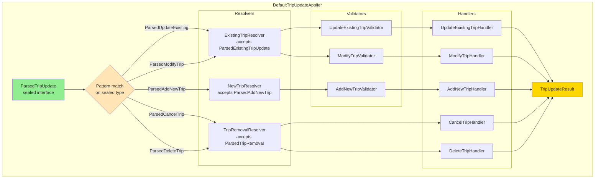

### Pipeline Orchestration

`DefaultTripUpdateApplier.apply()` orchestrates the pipeline using pattern matching on the sealed `ParsedTripUpdate` hierarchy. The compiler ensures exhaustiveness — every concrete type must be handled:

```java
public Result<TripUpdateResult, UpdateError> apply(ParsedTripUpdate parsedUpdate) {
  return switch (parsedUpdate) {
    case ParsedUpdateExisting u -> {
      var resolved = existingTripResolver.resolve(u);     // resolve (typed)
      var validated = updateExistingValidator.validate(resolved);  // validate
      yield updateExistingHandler.handle(resolved);               // handle
    }
    case ParsedModifyTrip u -> {
      var resolved = existingTripResolver.resolve(u);
      var validated = modifyTripValidator.validate(resolved);
      yield modifyTripHandler.handle(resolved);
    }
    case ParsedAddNewTrip u -> {
      var resolved = newTripResolver.resolve(u);
      var validated = addNewTripValidator.validate(resolved);
      yield addNewTripHandler.handle(resolved);
    }
    case ParsedCancelTrip u -> {
      var resolved = tripRemovalResolver.resolve(u);
      yield cancelTripHandler.handle(resolved);
    }
    case ParsedDeleteTrip u -> {
      var resolved = tripRemovalResolver.resolve(u);
      yield deleteTripHandler.handle(resolved);
    }
  };
}
```

Pattern matching provides the correctly-typed variable directly — each resolver receives its specific type (e.g., `ExistingTripResolver.resolve(ParsedExistingTripUpdate)`) rather than the broad base interface. Each stage returns `Result<T, UpdateError>` — if any stage fails, the pipeline short-circuits with the error.

### Update Flow by Type Diagram

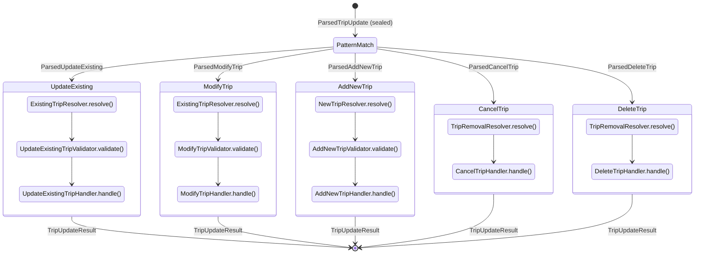

## Previous Architecture

### SIRI-ET Update Flow (Before)

```
SiriETUpdater
    └── EstimatedTimetableHandler
        └── SiriRealTimeTripUpdateAdapter
            ├── ModifiedTripBuilder (update existing trips)
            ├── AddedTripBuilder (new trips)
            └── ExtraCallTripBuilder (add stops)
                └── TripUpdate (SIRI-specific output)
                    └── RealTimeTripUpdate
                        └── TimetableSnapshotManager
```

#### SIRI-ET Architecture (Mermaid)

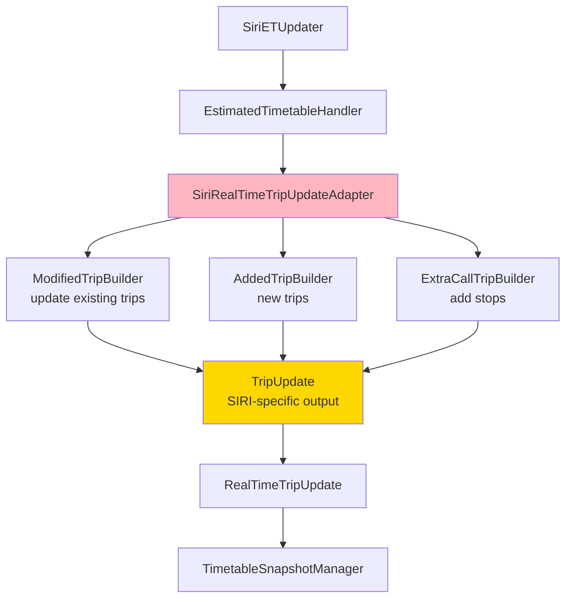

### GTFS-RT Update Flow (Before)

```
PollingTripUpdater
    └── TripUpdateGraphWriterRunnable
        └── GtfsRealTimeTripUpdateAdapter
            └── TripTimesUpdater
                └── TripTimesPatch (GTFS-specific output)
                    └── RealTimeTripUpdate
                        └── TimetableSnapshotManager
```

#### GTFS-RT Architecture (Mermaid)

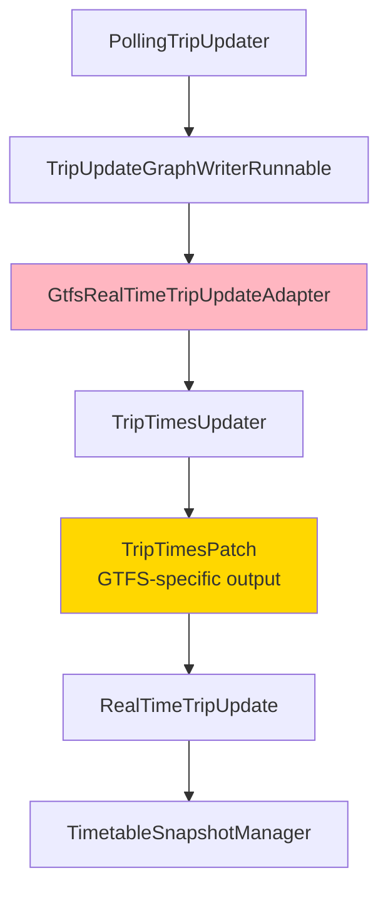

### Shared Infrastructure (Already Existed)

- `RealTimeTripUpdate`: Final output record for both updaters
- `TimetableSnapshotManager`: Buffer/commit pattern for updates
- `RealTimeTripTimesBuilder`: Builder for real-time trip times
- `TripPattern`, `StopPattern`: Domain models

## Common Model Design

### ParsedTripUpdate (Sealed Interface Hierarchy)

`ParsedTripUpdate` is a sealed interface hierarchy where the update type is encoded in the type system rather than as an enum field. Each concrete type carries only the fields relevant to that kind of update, making invalid states unrepresentable.

```
ParsedTripUpdate (sealed interface)
├── ParsedExistingTripUpdate (sealed interface) ── used by ExistingTripResolver
│   ├── ParsedUpdateExisting (final class)
│   └── ParsedModifyTrip (final class)
├── ParsedAddNewTrip (final class) ── used by NewTripResolver
└── ParsedTripRemoval (sealed interface) ── used by TripRemovalResolver
    ├── ParsedCancelTrip (final class)
    └── ParsedDeleteTrip (final class)
```

**Base interface** (shared by all 5 types):

```java
public sealed interface ParsedTripUpdate
    permits ParsedExistingTripUpdate, ParsedAddNewTrip, ParsedTripRemoval {
  TripReference tripReference();
  @Nullable LocalDate serviceDate();
  @Nullable ZonedDateTime aimedDepartureTime();
  @Nullable String dataSource();
  default boolean needsDeferredServiceDateResolution() { ... }
}
```

**Existing trip updates** (shared by UPDATE_EXISTING and MODIFY_TRIP):

```java
public sealed interface ParsedExistingTripUpdate extends ParsedTripUpdate
    permits ParsedUpdateExisting, ParsedModifyTrip {
  List<ParsedStopTimeUpdate> stopTimeUpdates();
  TripUpdateOptions options();
  default boolean hasStopSequences() { ... }
  @Nullable default TripCreationInfo tripCreationInfo() { return null; }
}
```

**Concrete leaf types:**

| Type | Fields | Builder / Constructor |
|------|--------|---------------------|
| `ParsedUpdateExisting` | tripReference, serviceDate, aimedDepartureTime, stopTimeUpdates, options, dataSource | `ParsedUpdateExisting.builder(tripRef, serviceDate)` |
| `ParsedModifyTrip` | same + optional tripCreationInfo, optional stopPatternModification | `ParsedModifyTrip.builder(tripRef, serviceDate)` |
| `ParsedAddNewTrip` | tripReference, serviceDate, aimedDepartureTime, stopTimeUpdates, **tripCreationInfo** (non-null), options, dataSource | `ParsedAddNewTrip.builder(tripRef, serviceDate, tripCreationInfo)` |
| `ParsedCancelTrip` | tripReference, serviceDate, aimedDepartureTime, dataSource | `new ParsedCancelTrip(tripRef, serviceDate, aimedDepartureTime, dataSource)` |
| `ParsedDeleteTrip` | tripReference, serviceDate, aimedDepartureTime, dataSource | `new ParsedDeleteTrip(tripRef, serviceDate, aimedDepartureTime, dataSource)` |

The `serviceDate` can be null when deferred resolution is used — the `ServiceDateResolver` calculates it from the `aimedDepartureTime` and the Trip's scheduled departure offset (handling overnight trips).

### TripUpdateType (Internal Parser Enum)

`TripUpdateType` is a simple enum used internally by both parsers (`SiriTripUpdateParser.determineUpdateType()` and `GtfsRtTripUpdateParser.mapScheduleRelationship()`) as an intermediate classification step before constructing the type-specific parsed objects. It is not exposed in the parsed model — the sealed type hierarchy itself encodes update semantics.

| Type | SIRI-ET | GTFS-RT |
|------|---------|---------|
| `UPDATE_EXISTING` | TRIP_UPDATE | SCHEDULED |
| `CANCEL_TRIP` | Cancellation=true | CANCELED |
| `DELETE_TRIP` | — | DELETED |
| `ADD_NEW_TRIP` | ExtraJourney=true | NEW, ADDED |
| `MODIFY_TRIP` | EXTRA_CALL | REPLACEMENT |

### Common Model Class Diagram

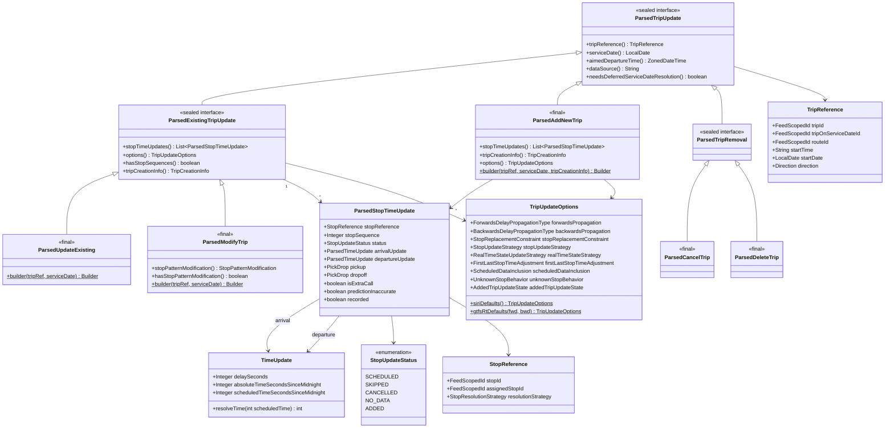

### Feature Comparison: UPDATE_EXISTING / TRIP_UPDATE

The `UPDATE_EXISTING` type (SIRI `TRIP_UPDATE` / GTFS-RT `SCHEDULED`) has different capabilities in each format:

| Feature | SIRI-ET | GTFS-RT |
|---------|---------|---------|
| Update arrival/departure times | ✅ | ✅ |
| Change pickup/dropoff types | ✅ | ✅ |
| Cancel individual stops | ✅ (`isCancellation`) | ✅ (`SKIPPED`) |
| Replace stop (same station) | ✅ | ✅ |
| Replace stop (any stop) | ❌ | ✅ (`assignedStopId`) |
| Add/remove stops | ❌ | ❌ |
| Cancel entire trip | ✅ | ✅ (via `CANCELED`) |

**Key Differences:**

1. **Stop Replacement Constraints:**
   - SIRI-ET: Stops can only be replaced by other stops belonging to the same station (`isPartOfSameStationAs`)
   - GTFS-RT: Any stop in the graph can replace another via `assignedStopId`

2. **Number of Stops:**
   - SIRI-ET: Must have exactly the same number of stops as the scheduled pattern (returns `TOO_FEW_STOPS` or `TOO_MANY_STOPS` errors)
   - GTFS-RT: Must have exactly the same number of stops as the scheduled pattern

3. **Adding Stops:**
   - SIRI-ET: Use `MODIFY_TRIP` update type with stops marked as `isExtraCall=true`
   - GTFS-RT: Use `MODIFY_TRIP` update type (maps to `REPLACEMENT`) to completely replace the stop pattern

### Feature Comparison: MODIFY_TRIP

The `MODIFY_TRIP` type allows modifying the stop pattern of an existing scheduled trip. This is used differently in each format:

| Feature | SIRI-ET (EXTRA_CALL) | GTFS-RT (REPLACEMENT) |
|---------|----------------------|----------------------|
| Requires existing scheduled trip | ✅ | ✅ |
| Insert new stops | ✅ (marked as extra call) | ✅ |
| Remove stops | ❌ | ✅ |
| Replace stop (same station) | ✅ | ✅ |
| Replace stop (any stop) | ❌ | ✅ |
| Change stop order | ❌ | ✅ |
| Completely new pattern | ❌ | ✅ |
| Update times | ✅ | ✅ |
| Change pickup/dropoff | ✅ | ✅ |

**Unified Model:**

Both SIRI-ET extra calls and GTFS-RT replacements use the single `MODIFY_TRIP` type:
- The `ParsedStopTimeUpdate.isExtraCall` flag identifies which stops are insertions (SIRI-specific)
- The `ModifyTripValidator` enforces SIRI-specific constraints when `isExtraCall` stops are present (insertions only, other stops must match via `StopReplacementValidator`)
- GTFS-RT has no such constraints (full pattern replacement)

### TripUpdateOptions (Processing Configuration)

Controls behavioral differences between SIRI-ET and GTFS-RT through configuration rather than code branching:

| Option | SIRI-ET Default | GTFS-RT Default | Purpose |
|--------|----------------|----------------|---------|
| `forwardsPropagation` | `NONE` | (configurable) | Delay interpolation for future stops |
| `backwardsPropagation` | `NONE` | (configurable) | Delay interpolation for past stops |
| `stopReplacementConstraint` | `SAME_PARENT_STATION` | `ANY_STOP` | Which stops can replace scheduled stops |
| `stopUpdateStrategy` | `FULL_UPDATE` | `PARTIAL_UPDATE` | Whether all stops must be present in the update |
| `realTimeStateStrategy` | `MODIFIED_ON_PATTERN_CHANGE` | `ALWAYS_UPDATED` | When to set RealTimeState on trip times |
| `firstLastStopTimeAdjustment` | `ADJUST` | `PRESERVE` | Whether to adjust first/last stop times to avoid negative dwell |
| `scheduledDataInclusion` | `INCLUDE` | `EXCLUDE` | Whether to include scheduled data for added trips |
| `unknownStopBehavior` | `FAIL` | `IGNORE` | What to do when an unknown stop is encountered |
| `addedTripUpdateState` | `SET_UPDATED` | `RETAIN_ADDED` | RealTimeState when re-updating an added trip |

### Resolved Model Types

The resolver stage transforms `ParsedTripUpdate` into one of three resolved types, each containing the domain objects needed by the handler:

- **`ResolvedExistingTrip`** — `Trip`, `TripPattern`, scheduled `TripPattern`, `TripTimes`, `TripOnServiceDate`, resolved `List<ResolvedStopTimeUpdate>`
- **`ResolvedNewTrip`** — service date, resolved stop time updates. For updates to previously added trips: existing `Trip`, `TripPattern`, `TripTimes`
- **`ResolvedTripRemoval`** — `FeedScopedId`, optionally `Trip`, `TripPattern`, `TripTimes` (null if not found in schedule — handler checks for added trips)
- **`ResolvedStopTimeUpdate`** — the original `ParsedStopTimeUpdate` plus resolved `TimeUpdate` (seconds since midnight) and `StopLocation`

## Interface Design

### TripUpdateParser Interface

```java
public interface TripUpdateParser<T> {
  Result<ParsedTripUpdate, UpdateError> parse(T update);
}
```

### TripUpdateApplier Interface

```java
public interface TripUpdateApplier {
  Result<TripUpdateResult, UpdateError> apply(ParsedTripUpdate parsedUpdate);
}
```

### TripUpdateValidator Interfaces

```java
public final class TripUpdateValidator {
  @FunctionalInterface
  public interface ForExistingTrip {
    Result<Void, UpdateError> validate(ResolvedExistingTrip resolvedUpdate);
  }

  @FunctionalInterface
  public interface ForNewTrip {
    Result<Void, UpdateError> validate(ResolvedNewTrip resolvedUpdate);
  }
}
```

### TripUpdateHandler Interfaces

```java
public final class TripUpdateHandler {
  @FunctionalInterface
  public interface ForExistingTrip {
    Result<TripUpdateResult, UpdateError> handle(ResolvedExistingTrip resolvedUpdate);
  }

  @FunctionalInterface
  public interface ForNewTrip {
    Result<TripUpdateResult, UpdateError> handle(ResolvedNewTrip resolvedUpdate);
  }

  @FunctionalInterface
  public interface ForTripRemoval {
    Result<TripUpdateResult, UpdateError> handle(ResolvedTripRemoval resolvedUpdate);
  }
}
```

### FuzzyTripMatcher Interface

```java
public interface FuzzyTripMatcher {
  Result<TripAndPattern, UpdateError> match(
    TripReference tripReference,
    ParsedExistingTripUpdate parsedUpdate,
    LocalDate serviceDate
  );
}
```

The matcher accepts `ParsedExistingTripUpdate` (not the base `ParsedTripUpdate`) because fuzzy matching only applies to existing trip updates — new trips and trip removals don't need it.

### Parser Responsibilities Diagram

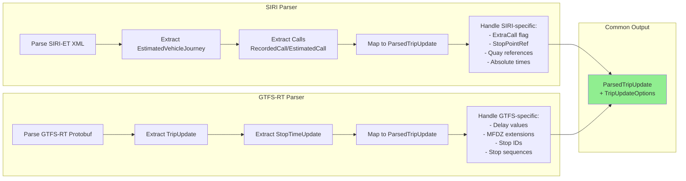

### SIRI Extra Call Sequence

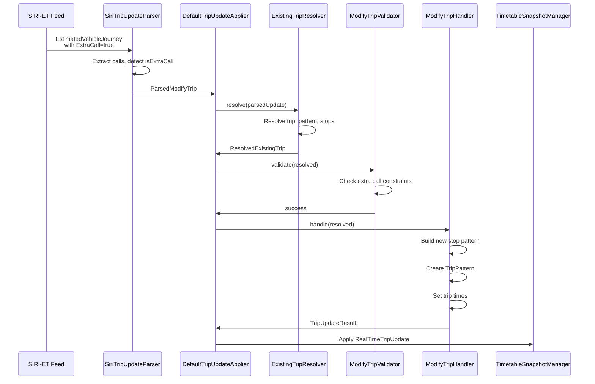

## Package Structure

### `org.opentripplanner.updater.trip.model` — Common Model

| File | Purpose |
|------|---------|
| `ParsedTripUpdate.java` | Sealed interface — base of the parsed update type hierarchy |
| `ParsedExistingTripUpdate.java` | Sealed interface for UPDATE_EXISTING and MODIFY_TRIP |
| `ParsedUpdateExisting.java` | Concrete class for updating times on existing trip |
| `ParsedModifyTrip.java` | Concrete class for modifying stop pattern of existing trip |
| `ParsedAddNewTrip.java` | Concrete class for adding a new trip (tripCreationInfo non-null) |
| `ParsedTripRemoval.java` | Sealed interface for CANCEL_TRIP and DELETE_TRIP |
| `ParsedCancelTrip.java` | Concrete class for cancelling a trip |
| `ParsedDeleteTrip.java` | Concrete class for deleting a trip |
| `TripUpdateType.java` | Internal parser enum for intermediate classification |
| `TripReference.java` | Trip identification |
| `ParsedStopTimeUpdate.java` | Stop-level update (parsed, unresolved) |
| `ParsedTimeUpdate.java` | Time update before resolution (delay or absolute) |
| `TimeUpdate.java` | Resolved time update (seconds since midnight) |
| `StopReference.java` | Stop identification with resolution strategy |
| `StopResolutionStrategy.java` | DIRECT or SCHEDULED_STOP_POINT_FIRST |
| `TripCreationInfo.java` | New trip creation info |
| `RouteCreationInfo.java` | New route creation info |
| `TripUpdateOptions.java` | Processing options (delay propagation, constraints, strategies) |
| `StopPatternModification.java` | Modifications to the stop pattern |
| `ResolvedExistingTrip.java` | Resolved data for existing trip updates |
| `ResolvedNewTrip.java` | Resolved data for new trip additions |
| `ResolvedTripRemoval.java` | Resolved data for trip cancellations/deletions |
| `ResolvedStopTimeUpdate.java` | Stop update with resolved stop and times |
| `StopReplacementConstraint.java` | SAME_PARENT_STATION or ANY_STOP |
| `StopUpdateStrategy.java` | FULL_UPDATE or PARTIAL_UPDATE |
| `RealTimeStateUpdateStrategy.java` | MODIFIED_ON_PATTERN_CHANGE or ALWAYS_UPDATED |
| `FirstLastStopTimeAdjustment.java` | ADJUST or PRESERVE |
| `ScheduledDataInclusion.java` | INCLUDE or EXCLUDE |
| `UnknownStopBehavior.java` | FAIL or IGNORE |
| `AddedTripUpdateState.java` | SET_UPDATED or RETAIN_ADDED |
| `DeferredTimeUpdate.java` | Time update deferred until resolution |

### `org.opentripplanner.updater.trip` — Pipeline Core

| File | Purpose |
|------|---------|
| `TripUpdateParser.java` | Parser interface |
| `TripUpdateApplier.java` | Applier interface |
| `DefaultTripUpdateApplier.java` | Pipeline orchestrator (resolve → validate → handle) |
| `ExistingTripResolver.java` | Resolves UPDATE_EXISTING and MODIFY_TRIP |
| `NewTripResolver.java` | Resolves ADD_NEW_TRIP |
| `TripRemovalResolver.java` | Resolves CANCEL_TRIP and DELETE_TRIP |
| `TripResolver.java` | Resolves Trip from TripReference |
| `ServiceDateResolver.java` | Resolves service dates (explicit, TripOnServiceDate, deferred) |
| `StopResolver.java` | Resolves StopLocation from StopReference |
| `FuzzyTripMatcher.java` | Fuzzy matching interface |
| `LastStopArrivalTimeMatcher.java` | SIRI-style fuzzy matcher |
| `RouteDirectionTimeMatcher.java` | GTFS-RT-style fuzzy matcher |
| `NoOpFuzzyTripMatcher.java` | No-op matcher (fuzzy matching disabled) |
| `TripAndPattern.java` | Result record for trip resolution |
| `TimetableSnapshotManager.java` | Buffer/commit pattern for updates |

### `org.opentripplanner.updater.trip.handlers` — Validators and Handlers

| File | Purpose |
|------|---------|
| `TripUpdateValidator.java` | Validator interfaces (ForExistingTrip, ForNewTrip) |
| `TripUpdateHandler.java` | Handler interfaces (ForExistingTrip, ForNewTrip, ForTripRemoval) |
| `TripUpdateResult.java` | Result record (RealTimeTripUpdate + warnings) |
| `UpdateExistingTripValidator.java` | Validates FULL_UPDATE constraints |
| `ModifyTripValidator.java` | Validates SIRI extra call constraints |
| `AddNewTripValidator.java` | Validates minimum stops and unknown stop behavior |
| `UpdateExistingTripHandler.java` | Updates times on existing trips |
| `ModifyTripHandler.java` | Modifies stop patterns on existing trips |
| `AddNewTripHandler.java` | Creates new trips or updates previously added trips |
| `CancelTripHandler.java` | Cancels trips (still visible) |
| `DeleteTripHandler.java` | Deletes trips (removed from routing) |
| `AbstractTripRemovalHandler.java` | Base class for cancel/delete handlers |
| `HandlerUtils.java` | Shared utilities (build stop patterns, apply updates, etc.) |
| `StopReplacementValidator.java` | Validates stop replacement constraints |
| `RouteCreationStrategy.java` | Interface for creating routes |
| `SiriRouteCreationStrategy.java` | SIRI-style route creation |
| `GtfsRtRouteCreationStrategy.java` | GTFS-RT-style route creation |

### `org.opentripplanner.updater.trip.siri` — SIRI Parser

| File | Purpose |
|------|---------|
| `SiriTripUpdateParser.java` | Parses EstimatedVehicleJourney → ParsedTripUpdate |

### `org.opentripplanner.updater.trip.gtfs` — GTFS-RT Parser

| File | Purpose |
|------|---------|
| `GtfsRtTripUpdateParser.java` | Parses GtfsRealtime.TripUpdate → ParsedTripUpdate |

### `org.opentripplanner.updater.trip.patterncache` — Pattern Caching

| File | Purpose |
|------|---------|
| `TripPatternCache.java` | Unified pattern cache (replaces separate SIRI/GTFS caches) |
| `TripPatternIdGenerator.java` | ID generation for real-time patterns |

## Challenges and Mitigations

### 1. SIRI Extra Calls (Adding Stops)

**Challenge:** SIRI supports adding extra stops to existing trips, which GTFS-RT does not directly support.

**Mitigation:**
- Both use unified `MODIFY_TRIP` type
- `isExtraCall` flag on `ParsedStopTimeUpdate` identifies SIRI insertions
- `ModifyTripValidator` enforces SIRI constraints when `isExtraCall` stops are present

### 2. GTFS-RT Delay Interpolation

**Challenge:** GTFS-RT often provides partial updates requiring delay interpolation; SIRI provides explicit times.

**Mitigation:**
- `TripUpdateOptions` carries format-specific delay propagation configuration
- SIRI parsers set `forwardsPropagation=NONE`, `backwardsPropagation=NONE`
- GTFS-RT parsers configure based on updater settings
- Handler applies interpolation only when configured

### 3. Different Fuzzy Matching

**Challenge:** Different fuzzy matching implementations for SIRI vs GTFS-RT.

**Mitigation:**
- Common `FuzzyTripMatcher` interface
- Two implementations: `LastStopArrivalTimeMatcher` (SIRI), `RouteDirectionTimeMatcher` (GTFS-RT)
- `ExistingTripResolver` uses fuzzy matching when a `FuzzyTripMatcher` is configured

### 4. Entity Resolution

**Challenge:** SIRI uses NeTEx-style quay references; GTFS uses stop IDs.

**Mitigation:**
- `StopReference` supports both with `StopResolutionStrategy`
- `StopResolver` handles both: `SCHEDULED_STOP_POINT_FIRST` for SIRI, `DIRECT` for GTFS

### 5. Behavioral Differences via Configuration

**Challenge:** SIRI-ET and GTFS-RT have subtly different semantics for the same operations.

**Mitigation:**
- `TripUpdateOptions` captures all behavioral differences as configuration
- Handlers use option values to branch behavior (e.g., `unknownStopBehavior`, `stopReplacementConstraint`)
- Factory methods `siriDefaults()` and `gtfsRtDefaults()` provide format-appropriate defaults

### Key Design Patterns

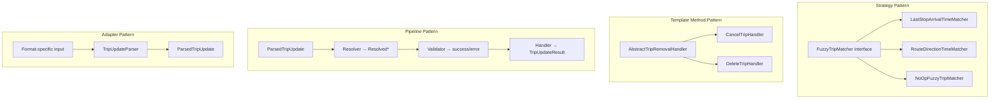

## Testing Strategy

### Unit Tests

1. **Parser Tests:** Test each parser with format-specific fixtures, verify correct mapping to common model, error handling, edge cases

2. **Resolver Tests:** Test each resolver independently with mock `TransitService`, verify trip/stop/date resolution, fuzzy matching integration

3. **Validator Tests:** Test each validator with resolved data, verify correct acceptance/rejection of preconditions

4. **Handler Tests:** Test each handler with resolved data, verify correct `RealTimeTripUpdate` output, delay interpolation, pattern creation

5. **Applier Tests:** End-to-end pipeline tests through `DefaultTripUpdateApplier`

### Integration Tests

- Run existing SIRI-ET and GTFS-RT integration tests against the new pipeline
- Regression tests for known edge cases

## Benefits

1. **Reduced Code Duplication:** Common pipeline eliminates duplicated update logic from SIRI and GTFS-RT adapters

2. **Consistent Behavior:** Both formats use the same code path for resolving, validating, and applying updates

3. **Easier Maintenance:** Bug fixes and improvements apply to both formats

4. **Better Testability:** Each pipeline stage can be tested independently; common model enables format-agnostic testing

5. **Clearer Separation of Concerns:** Parsing (format-specific), resolution, validation, and mutation are clearly separated

6. **Extensibility:** Adding new formats only requires a new parser and appropriate `TripUpdateOptions`; all pipeline stages are reused

7. **Configuration over Code Branching:** Behavioral differences between formats are captured in `TripUpdateOptions` rather than scattered if/else branches

## References

- [SIRI-ET Specification](https://www.vdv.de/siri.aspx)
- [GTFS-RT Specification](https://developers.google.com/transit/gtfs-realtime)
- OTP Documentation: `doc/user/UpdaterConfig.md`
- Implementation: `application/src/main/java/org/opentripplanner/updater/trip/`
