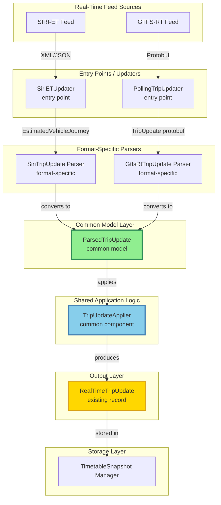
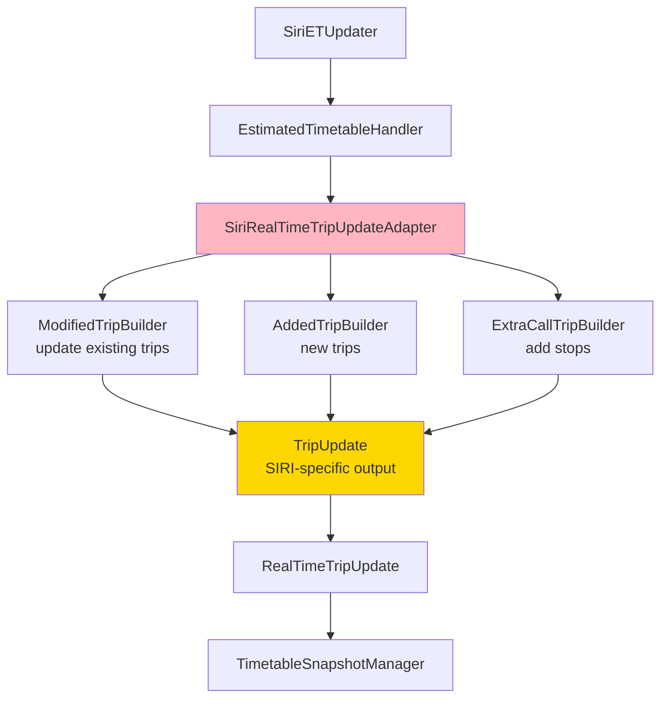
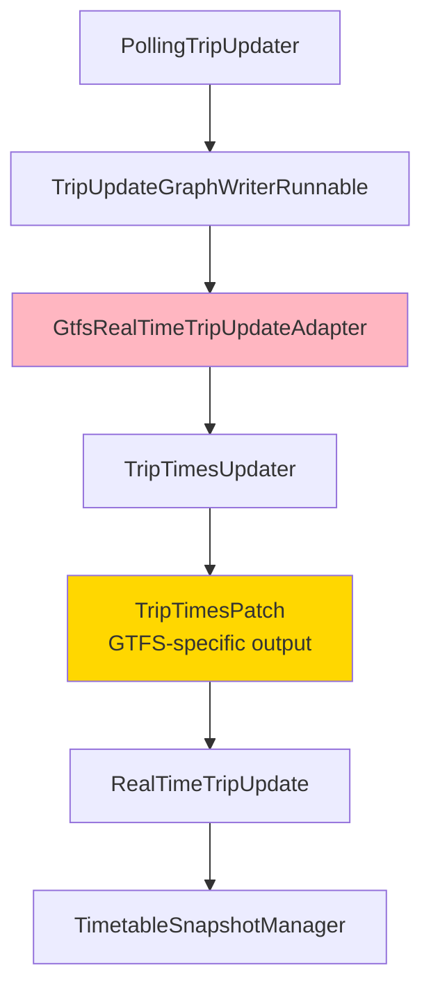
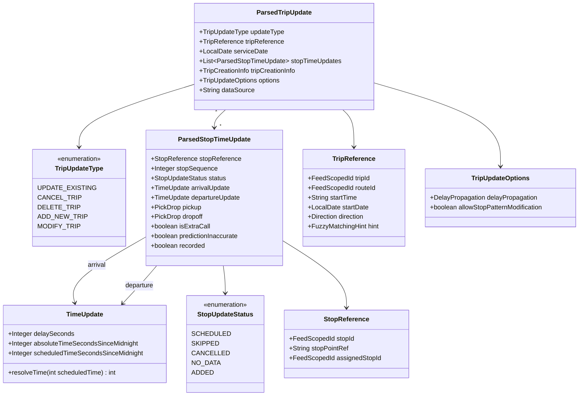
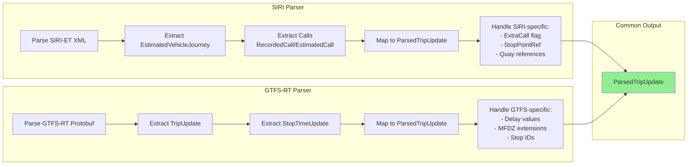
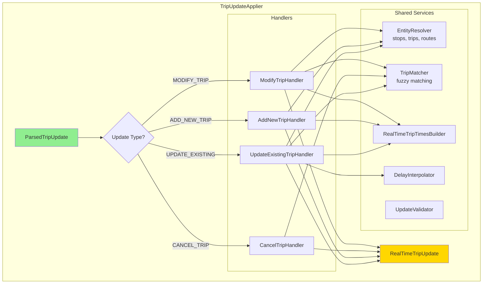
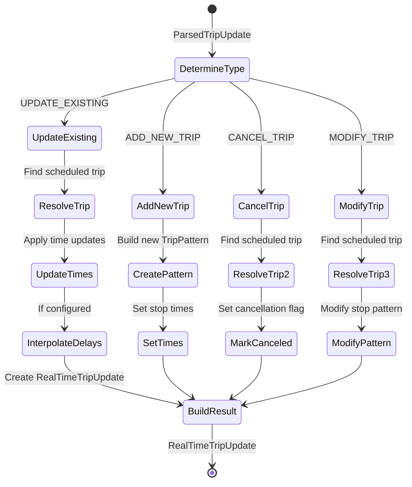
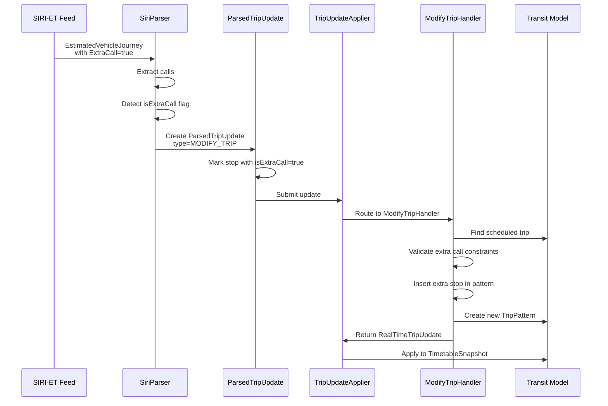
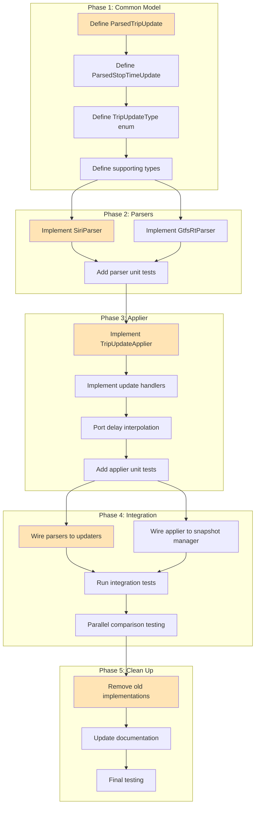
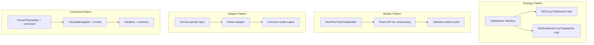

# Unified Real-Time Trip Updaters Design Document

## Overview

This document describes a proposed refactoring of the SIRI-ET and GTFS-RT real-time trip updaters in OpenTripPlanner to share common logic for applying updates to the transit model.

## Problem Statement

OTP supports real-time trip updates from two feed formats:
- **SIRI-ET** (Service Interface for Real-time Information - Estimated Timetable)
- **GTFS-RT** (General Transit Feed Specification - Realtime)

Both updaters implement the same use cases:
- Updating arrival/departure times for existing trips
- Cancelling trips
- Adding new trips not in the schedule
- Modifying stop patterns (skipping stops, adding stops)

Currently, each updater has its own implementation for applying these updates to the transit model, leading to:
- Duplicated logic
- Inconsistent behavior between formats
- Higher maintenance burden
- Harder to add new features consistently

## Proposed Solution

Split each updater into two sub-components:

1. **Parser** (format-specific): Parses real-time messages and converts them to a common model
2. **Applier** (shared): Applies the common model changes to the transit model

```
┌─────────────────────────────────────────────────────────────────────────────┐
│                           Real-Time Update Flow                              │
└─────────────────────────────────────────────────────────────────────────────┘

                SIRI-ET Feed                           GTFS-RT Feed
                     │                                      │
                     ▼                                      ▼
          ┌──────────────────┐                   ┌──────────────────┐
          │  SiriETUpdater   │                   │PollingTripUpdater│
          │  (entry point)   │                   │  (entry point)   │
          └────────┬─────────┘                   └────────┬─────────┘
                   │                                      │
                   ▼                                      ▼
          ┌──────────────────┐                   ┌──────────────────┐
          │SiriTripUpdate    │                   │GtfsRtTripUpdate  │
          │    Parser        │                   │    Parser        │
          │(format-specific) │                   │(format-specific) │
          └────────┬─────────┘                   └────────┬─────────┘
                   │                                      │
                   │      ParsedTripUpdate                │
                   │      (common model)                  │
                   │                                      │
                   └──────────────┬───────────────────────┘
                                  │
                                  ▼
                        ┌──────────────────┐
                        │ TripUpdateApplier│
                        │(common component)│
                        └────────┬─────────┘
                                 │
                                 ▼
                        ┌──────────────────┐
                        │RealTimeTripUpdate│
                        │(existing record) │
                        └────────┬─────────┘
                                 │
                                 ▼
                        ┌──────────────────┐
                        │TimetableSnapshot │
                        │    Manager       │
                        └──────────────────┘
```

### Real-Time Update Flow (Mermaid)



## Current Architecture

### SIRI-ET Update Flow

```
SiriETUpdater
    └── EstimatedTimetableHandler
        └── SiriRealTimeTripUpdateAdapter
            ├── ModifiedTripBuilder (update existing trips)
            ├── AddedTripBuilder (new trips)
            └── ExtraCallTripBuilder (add stops)
                └── TripUpdate (SIRI-specific output)
                    └── RealTimeTripUpdate
                        └── TimetableSnapshotManager
```

**Key Classes:**
- `SiriRealTimeTripUpdateAdapter`: Main adapter coordinating updates
- `EntityResolver`: Resolves SIRI references to OTP entities
- `SiriFuzzyTripMatcher`: Matches trips when exact IDs unavailable
- `CallWrapper`: Unified interface for EstimatedCall/RecordedCall
- `TimetableHelper`: Applies time updates to trip times

#### SIRI-ET Architecture (Mermaid)



### GTFS-RT Update Flow

```
PollingTripUpdater
    └── TripUpdateGraphWriterRunnable
        └── GtfsRealTimeTripUpdateAdapter
            └── TripTimesUpdater
                └── TripTimesPatch (GTFS-specific output)
                    └── RealTimeTripUpdate
                        └── TimetableSnapshotManager
```

**Key Classes:**
- `GtfsRealTimeTripUpdateAdapter`: Main adapter with update logic
- `TripTimesUpdater`: Creates/updates trip times from GTFS-RT messages
- `TripUpdate`, `StopTimeUpdate`, `TripDescriptor`: Wrapper classes for protobuf
- `ForwardsDelayInterpolator`, `BackwardsDelayInterpolator`: Delay propagation

#### GTFS-RT Architecture (Mermaid)



### Shared Infrastructure (Already Exists)

- `RealTimeTripUpdate`: Final output record for both updaters
- `TimetableSnapshotManager`: Buffer/commit pattern for updates
- `RealTimeTripTimesBuilder`: Builder for real-time trip times
- `TripPattern`, `StopPattern`: Domain models

## Common Model Design

### ParsedTripUpdate (Main Class)

```java
package org.opentripplanner.updater.trip.model;

/**
 * Format-independent representation of a trip update parsed from either
 * SIRI-ET or GTFS-RT. Immutable class with builder pattern.
 */
public final class ParsedTripUpdate {

  private final TripUpdateType updateType;
  private final TripReference tripReference;
  private final LocalDate serviceDate;
  private final List<ParsedStopTimeUpdate> stopTimeUpdates;
  @Nullable private final TripCreationInfo tripCreationInfo;
  @Nullable private final StopPatternModification stopPatternModification;
  private final TripUpdateOptions options;
  @Nullable private final String dataSource;
}
```

### TripUpdateType (Enum)

Maps update semantics from both formats:

| Type | Description | SIRI-ET | GTFS-RT |
|------|-------------|---------|---------|
| `UPDATE_EXISTING` | Update times on existing trip | TRIP_UPDATE | SCHEDULED |
| `CANCEL_TRIP` | Cancel entire trip | Cancellation=true | CANCELED |
| `DELETE_TRIP` | Delete trip (remove from schedule) | — | DELETED |
| `ADD_NEW_TRIP` | Add trip not in schedule | ExtraJourney=true | NEW, ADDED |
| `MODIFY_TRIP` | Modify stop pattern | EXTRA_CALL | REPLACEMENT |

### TripReference (Trip Identification)

```java
public final class TripReference {

  @Nullable private final FeedScopedId tripId;
  @Nullable private final FeedScopedId routeId;
  @Nullable private final String startTime;
  @Nullable private final LocalDate startDate;
  @Nullable private final Direction direction;
  private final FuzzyMatchingHint fuzzyMatchingHint;

  public enum FuzzyMatchingHint {
    EXACT_MATCH_REQUIRED,
    FUZZY_MATCH_ALLOWED
  }
}
```

### ParsedStopTimeUpdate (Stop-Level Update)

```java
public final class ParsedStopTimeUpdate {

  private final StopReference stopReference;
  @Nullable private final Integer stopSequence;
  private final StopUpdateStatus status;
  @Nullable private final TimeUpdate arrivalUpdate;
  @Nullable private final TimeUpdate departureUpdate;
  @Nullable private final PickDrop pickup;
  @Nullable private final PickDrop dropoff;
  @Nullable private final I18NString stopHeadsign;
  @Nullable private final OccupancyStatus occupancy;
  private final boolean isExtraCall;
  private final boolean predictionInaccurate;
  private final boolean recorded;

  public enum StopUpdateStatus {
    SCHEDULED,  // Normal scheduled stop
    SKIPPED,    // Stop is skipped
    CANCELLED,  // Stop is cancelled
    NO_DATA,    // No prediction available
    ADDED       // Extra call (not in schedule)
  }
}
```

### TimeUpdate (Unified Time Representation)

Handles both SIRI's explicit times and GTFS-RT's delay-based times. Immutable class:

```java
public final class TimeUpdate {

  @Nullable private final Integer delaySeconds;
  @Nullable private final Integer absoluteTimeSecondsSinceMidnight;
  @Nullable private final Integer scheduledTimeSecondsSinceMidnight;
}
```

### StopReference (Stop Identification)

Supports both GTFS stop IDs and SIRI quay references. Immutable class:

```java
public final class StopReference {

  @Nullable private final FeedScopedId stopId;
  @Nullable private final String stopPointRef;
  @Nullable private final FeedScopedId assignedStopId;
}
```

### TripCreationInfo (For New Trips)

```java
public final class TripCreationInfo {

  private final FeedScopedId tripId;
  @Nullable private final FeedScopedId routeId;
  @Nullable private final RouteCreationInfo routeCreationInfo;
  @Nullable private final FeedScopedId serviceId;
  @Nullable private final I18NString headsign;
  @Nullable private final String shortName;
  @Nullable private final TransitMode mode;
  @Nullable private final String submode;
  @Nullable private final FeedScopedId operatorId;
  @Nullable private final Accessibility wheelchairAccessibility;
  private final List<FeedScopedId> replacedTrips;
}
```

### TripUpdateOptions (Processing Configuration)

```java
public final class TripUpdateOptions {
  private final ForwardsDelayPropagationType forwardsPropagation;
  private final BackwardsDelayPropagationType backwardsPropagation;
  private final boolean allowStopPatternModification;

  // SIRI provides explicit times; no delay interpolation needed
  public static TripUpdateOptions siriDefaults() {
    return new TripUpdateOptions(
      ForwardsDelayPropagationType.NONE,
      BackwardsDelayPropagationType.NONE,
      true
    );
  }

  // GTFS-RT may need delay interpolation
  public static TripUpdateOptions gtfsRtDefaults(
    ForwardsDelayPropagationType forward,
    BackwardsDelayPropagationType backward
  ) {
    return new TripUpdateOptions(forward, backward, true);
  }

  // Constructor, getters, builder, propagatesDelays(), equals, hashCode, toString
}
```

### Common Model Class Diagram



## Interface Design

### TripUpdateParser Interface

```java
package org.opentripplanner.updater.trip;

/**
 * Parses format-specific real-time messages into the common model.
 */
public interface TripUpdateParser<T> {
    /**
     * Parse a single format-specific update into the common model.
     *
     * @param update the format-specific update
     * @param context parsing context containing entity resolver, trip matcher, etc.
     * @return Result containing either parsed update or error
     */
    Result<ParsedTripUpdate, UpdateError> parse(T update, TripUpdateParserContext context);
}

public final class TripUpdateParserContext {
  private final String feedId;
  private final ZoneId timeZone;
  private final Supplier<LocalDate> localDateNow;
  // Constructor, getters, createId() helper method
}
```

### TripUpdateApplier Interface

```java
package org.opentripplanner.updater.trip;

/**
 * Applies parsed trip updates to the transit model.
 * This is the common component shared by both SIRI-ET and GTFS-RT.
 */
public interface TripUpdateApplier {
    /**
     * Apply a parsed trip update to create/update trip times.
     *
     * @param parsedUpdate the format-independent parsed update
     * @param context application context
     * @return Result containing RealTimeTripUpdate for the snapshot manager
     */
    Result<RealTimeTripUpdate, UpdateError> apply(
        ParsedTripUpdate parsedUpdate,
        TripUpdateApplierContext context
    );
}

public final class TripUpdateApplierContext {
  private final String feedId;
  @Nullable private final TimetableSnapshotManager snapshotManager;
  // Constructor, getters
}
```

### TripMatcher Interface (Common Fuzzy Matching)

```java
package org.opentripplanner.updater.trip;

/**
 * Common interface for trip matching (fuzzy or exact).
 */
public interface TripMatcher {
    Result<TripAndPattern, UpdateError> matchTrip(
        TripReference reference,
        Function<TripPattern, Timetable> getTimetable
    );
}
```

## Implementation Plan

### Phase 1: Create Common Model Package

Create new package `org.opentripplanner.updater.trip.model` with:
- `ParsedTripUpdate.java`
- `TripUpdateType.java`
- `TripReference.java`
- `ParsedStopTimeUpdate.java`
- `TimeUpdate.java`
- `StopReference.java`
- `TripCreationInfo.java`
- `StopPatternModification.java`
- `TripUpdateOptions.java`

### Phase 2: Create Parser Interface and Implementations

1. **Create interface:** `TripUpdateParser<T>`

2. **Implement SiriTripUpdateParser:**
   - Extract parsing logic from `SiriRealTimeTripUpdateAdapter`
   - Reuse: `EntityResolver`, `SiriFuzzyTripMatcher`, `CallWrapper`
   - Convert `EstimatedVehicleJourney` → `ParsedTripUpdate`

3. **Implement GtfsRtTripUpdateParser:**
   - Extract parsing logic from `GtfsRealTimeTripUpdateAdapter`
   - Convert `GtfsRealtime.TripUpdate` → `ParsedTripUpdate`
   - Handle MFDZ extensions

### Phase 3: Create Common Applier

1. **Create interface:** `TripUpdateApplier`

2. **Implement DefaultTripUpdateApplier:**
   - Consolidate logic from:
     - `SiriRealTimeTripUpdateAdapter.addTripToGraphAndBuffer()`
     - `ModifiedTripBuilder`, `AddedTripBuilder`, `ExtraCallTripBuilder`
     - `GtfsRealTimeTripUpdateAdapter.handleScheduledTrip()`, etc.
     - `TripTimesUpdater.createUpdatedTripTimesFromGtfsRt()`

3. **Merge TripPatternCache implementations:**
   - Combine `SiriTripPatternCache` and `TripPatternCache`

### Phase 4: Integrate into Existing Updaters

Modify updaters to use new architecture while maintaining backward compatibility:

```java
// Example: SiriETUpdater integration
public void applyEstimatedTimetable(
    List<EstimatedTimetableDeliveryStructure> deliveries,
    UpdateIncrementality incrementality
) {
    if (incrementality == FULL_DATASET) {
        snapshotManager.clearBuffer(feedId);
    }

    for (var delivery : deliveries) {
        for (var frame : delivery.getEstimatedJourneyVersionFrames()) {
            for (var journey : frame.getEstimatedVehicleJourneys()) {
                var parseResult = siriParser.parse(journey, parserContext);
                if (parseResult.isSuccess()) {
                    var applyResult = applier.apply(parseResult.get(), applierContext);
                    if (applyResult.isSuccess()) {
                        snapshotManager.updateBuffer(applyResult.get());
                    }
                }
            }
        }
    }
}
```

### Phase 5: Clean Up

- Deprecate and remove duplicated code
- Update documentation
- Add migration notes to changelog

## Files to Modify

| File | Changes |
|------|---------|
| `updater/trip/siri/SiriRealTimeTripUpdateAdapter.java` | Extract parsing to parser, simplify |
| `updater/trip/gtfs/GtfsRealTimeTripUpdateAdapter.java` | Extract parsing to parser, simplify |
| `updater/trip/gtfs/TripTimesUpdater.java` | Move core logic to applier |
| `updater/trip/siri/ModifiedTripBuilder.java` | Logic moves to applier |
| `updater/trip/siri/AddedTripBuilder.java` | Logic moves to applier |
| `updater/trip/siri/ExtraCallTripBuilder.java` | Logic moves to applier |
| `updater/trip/siri/SiriTripPatternCache.java` | Merge with TripPatternCache |
| `updater/trip/gtfs/TripPatternCache.java` | Merge with SiriTripPatternCache |

## New Files to Create

| File | Purpose |
|------|---------|
| `updater/trip/model/ParsedTripUpdate.java` | Common model record |
| `updater/trip/model/TripUpdateType.java` | Update type enum |
| `updater/trip/model/TripReference.java` | Trip identification |
| `updater/trip/model/ParsedStopTimeUpdate.java` | Stop-level update |
| `updater/trip/model/TimeUpdate.java` | Time representation |
| `updater/trip/model/StopReference.java` | Stop identification |
| `updater/trip/model/TripCreationInfo.java` | New trip creation info |
| `updater/trip/model/TripUpdateOptions.java` | Processing options |
| `updater/trip/TripUpdateParser.java` | Parser interface |
| `updater/trip/TripUpdateApplier.java` | Applier interface |
| `updater/trip/DefaultTripUpdateApplier.java` | Common applier |
| `updater/trip/siri/SiriTripUpdateParser.java` | SIRI parser |
| `updater/trip/gtfs/GtfsRtTripUpdateParser.java` | GTFS-RT parser |
| `updater/trip/UnifiedTripPatternCache.java` | Merged pattern cache |

### Parser Responsibilities Diagram



### Applier Component Structure



## Challenges and Mitigations

### 1. SIRI Extra Calls (Adding Stops)

**Challenge:** SIRI supports adding extra stops to existing trips, which GTFS-RT does not directly support.

**Mitigation:**
- Both use unified `MODIFY_TRIP` type
- `isExtraCall` flag on `ParsedStopTimeUpdate` identifies SIRI insertions
- Applier enforces SIRI constraints when `isExtraCall` stops are present

### 2. GTFS-RT Delay Interpolation

**Challenge:** GTFS-RT often provides partial updates requiring delay interpolation; SIRI provides explicit times.

**Mitigation:**
- `TripUpdateOptions.DelayPropagation` configuration per format
- SIRI parsers set `propagateForward=false`
- GTFS-RT parsers configure based on updater settings
- Applier applies interpolation only when configured

### 3. Different Fuzzy Matching

**Challenge:** Different fuzzy matching implementations for SIRI vs GTFS-RT.

**Mitigation:**
- Common `TripMatcher` interface
- Two implementations: `SiriFuzzyTripMatcher`, `GtfsRealtimeFuzzyTripMatcher`
- Parser context provides the appropriate matcher

### 4. Entity Resolution

**Challenge:** SIRI uses NeTEx-style quay references; GTFS uses stop IDs.

**Mitigation:**
- `StopReference` supports both `stopId` and `stopPointRef`
- Applier uses `EntityResolver` to resolve both formats
- SIRI parser creates `StopReference.ofStopPointRef()`
- GTFS parser creates `StopReference.ofStopId()`

### 5. MFDZ Extensions

**Challenge:** GTFS-RT MFDZ extensions for pickup/dropoff types and other properties.

**Mitigation:**
- Parser handles extensions during conversion
- Maps to common `PickDrop` enum
- Common model is extension-agnostic

### Update Flow by Type Diagram



### SIRI Extra Call Sequence



## Testing Strategy

### Unit Tests

1. **Parser Tests:**
   - Test each parser with format-specific fixtures
   - Verify correct mapping to common model
   - Test error handling for invalid inputs
   - Test edge cases (missing fields, malformed data)

2. **Applier Tests:**
   - Test each update type independently
   - Use mock `TransitEditorService` and `TimetableSnapshotManager`
   - Verify correct `RealTimeTripUpdate` output
   - Test delay interpolation

3. **Round-Trip Tests:**
   - Parse → Apply → Verify identical behavior to old implementation

### Integration Tests

- Run existing SIRI-ET and GTFS-RT integration tests
- Add new integration tests for combined scenarios
- Regression tests for known edge cases

### Comparison Testing

- Run both old and new implementations in parallel
- Compare outputs for identical inputs
- Log any differences for investigation

## Benefits

1. **Reduced Code Duplication:** Common applier eliminates duplicated update logic

2. **Consistent Behavior:** Both formats use the same code path for applying updates

3. **Easier Maintenance:** Bug fixes and improvements apply to both formats

4. **Better Testability:** Common model enables format-agnostic testing

5. **Clearer Separation of Concerns:** Parsing vs application logic clearly separated

6. **Extensibility:** Adding new formats (e.g., GTFS-RT v3) only requires a new parser

## Risks and Mitigation

| Risk | Impact | Mitigation |
|------|--------|------------|
| Regression in existing behavior | High | Extensive testing, parallel running, feature flag |
| Performance degradation | Medium | Benchmark before/after, optimize hot paths |
| Incomplete common model | Medium | Iterative refinement, start with core cases |
| Migration complexity | Medium | Phased approach, backward compatibility |

## Timeline Estimate

| Phase | Effort |
|-------|--------|
| Phase 1: Common Model | 2-3 days |
| Phase 2: Parsers | 3-4 days |
| Phase 3: Applier | 4-5 days |
| Phase 4: Integration | 2-3 days |
| Phase 5: Clean Up | 1-2 days |
| **Total** | **12-17 days** |

### Migration Strategy Diagram



### Key Design Patterns



## References

- [SIRI-ET Specification](https://www.vdv.de/siri.aspx)
- [GTFS-RT Specification](https://developers.google.com/transit/gtfs-realtime)
- OTP Documentation: `doc/user/UpdaterConfig.md`
- Existing Implementation: `application/src/main/java/org/opentripplanner/updater/trip/`
