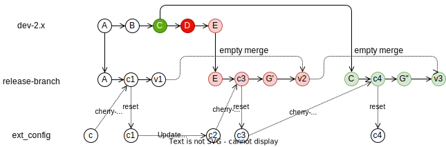

# README - OTP Fork Release Scripts

**Note! This describes how you can set up and release OTP in you own GitHub fork, not how OTP in the
main repo is released.**

## Introduction

The scripts here can be used to release a fork of OTP. Run

```
# script/prepare_release otp/dev-2.x
# script/release
```

### Process overview

- Run all scripts from the root of the OTP project, see example above. You may have to set the
  script file permissions.
- Run the `prepare_release` script to prepare the release. This script will rebase the release
  branch on top of the base branch, merge in the `ext_config` branch and run all tests.
  - You specify the _base branch_, normally `dev-2.x` in git repo [`opentripplanner/OpenTripPlanner`](https://github.com/opentripplanner/OpenTripPlanner).
    The _release-branch_ (in your fork) is rebased on top of the _base-branch_. **Nothing is kept 
    from previous releases.**
  - The top commit in the `ext_config` branch is merged in with the deployment-specific config.
  - If there is a conflict you will need to resolve it.
  - The last step in the prepare release is to make sure the `otp.serialization.version.id` is
    set to the correct value.
  - If something goes wrong, like a conflicting merge or failing unit-test, you may fix the problem
    and resume the release by running the `prepare_release` script again. Use the exact same arguments.
- After the `prepare_release`, but before you run `release` you may merge in any feature branches. 
  The 2 steps allow you to merge in "work in progress" before the final release is made.
- Run the `release` script
  - Each release is given a unique version number specific to your fork, like `v2.7.0-MY_ORG-1`.
  - The release is tagged with the version in the Git repository.
  - The old release is then merged with an _empty merge_, this is done to create a continuous line
    of releases in the release branch for easy viewing and navigation of the git history. Nothing
    from the previous release is copied into the new release. We call this an _empty merge_.
  - Finally, the release is pushed to the remote GitHub repository. You should build the release on
    a CI server and deploy any artifacts to your organisation artifact repository(if you have one). 
 

### Advanced Git flow - roll back



Each release has a single commit as a base, this allows us to choose any commit as the base and
safely **Roll-back, by rolling forward**. In the diagram above, commit (D) contained a bug. So, we
can go back to commit (C). If we merged `dev2-x` into the release-branch then going back to this
commit would be challenging since commit (D) was already in the release branch at this point. 
Also note that the CI configuration is changed (c2) and this change needs to be included in the
new release (v3). 
 
> **Note!** OTP ignore config it does not understand it. This allows us to roll out config for new 
> features BEFORE we roll out the new version of OTP. We can then verify that the old version of 
> OTP works with the new config. Config is dependent on both the environment OTP run in and OTP. 
> So, the config has its own life-cycle, independent of the OTP software.


### Advanced Git flow - rollback and a feature branch


After the `prepare_release` script is run, you may merge in any number of _feature branches_. 


## The `ext_config` branch

You should create a branch in the local git repository where you keep your deployment-specific 
config. The `ext_config` branch should have **one** commit with all changes needed. If you need to
change the config, you will have to amend the changes. This is because the release script chery-pick
the top commit and then reset the `ext_config` branch.

The branch must include:

 - The `script/release_env` script, containing the target release information.

The branch may include:

 - Local CI build configuration.
 - OTP deployment configuration.

### The `otp.serialization.version.id` Maven property

The `otp.serialization.version.id` property in the root _pom.xml_ file is used to identify the 
serialization version of the OTP graph. When merging in the `ext_config` branch, you might get a
conflict. Resolve the conflict and amend the commit to `ext_config`. The serialization version id 
is likely to get out of sync with the upstream project, especially if you have feature branches you
merge in. In this case we recommend using a deployment specific serialization version id, like 
`<ORG>-<SEQ-NR>` for example `EN-0045`. You must maintain the serialization version id manually.


## Setup

 Create a script in your local fork with the release target git repo and branch name. This small
 script is used by the `prepare_release` and `release` scripts to identify the target git repository
 and branch. 

#### Add file _script/release_env_

```bach
#!/usr/bin/env bash

export GIT_REMOTE_RELEASE_BRANCH="<release branch>"
export GIT_REMOTE_RELEASE_ORG="<org>"
```

Substitute `<org>` and `<release branch>` with the correct values. Commit and push this file to 
the `ext_config` branch in your organizations fork of OTP. Note! The <org> must match the 
GitHub organization name in your local Git clone. Use `git remote -v` to list all remote repos.


## Pending Pull Requests

You may want to merge in pending PRs when releasing your fork. The two-step build process 
(`prepare_release` and then `release`) allow you to merge in any feature branches, before the 
final release is made. At Entur we label all PRs we want to be merged into the next release with 
`Entur test`, this ensures that any team member can do the release. This allows us to test features
at Entur before the PR is accepted and merged in the upstream repo. We combine this with config, 
and sometimes the OTPFeature toggle to turn on new features in over test environment. When a new 
feature is tested ok, then we enable it in the production environment. 


## How To Make A Release

Find the target branch/commit or use the branch `otp/dev-2.x`. If you use a specific branch/commit, 
then replace `otp/dev-2.x` below with your branch/commit hash.

Run the `prepare_release` script. The script does the following:
- Reset main to the right latest commit on `dev-2.x`
- Rebase and merge in the `ext_config` extension branches into the local release branch. You will
  be prompted for each step allowing you to perform/skip the steps you want. Also. the script keeps
  track of the progress and will resume where it stopped in case of a merge conflict or compile
  error. If the script aborts, you should fix the problem (resolve conflicts or fix compile errors)
  and run the script again.


### Run the `prepare_release` script

The `--dryRun` options is used to run the script and skip pushing changes to the remote repo. Be
aware that the local git repo is changed, and you must manually revert all changes. The `--dryRun` 
option is used to test the script.

```bash
git fetch otp
git fetch entur
git checkout ext_config
git pull
script/prepare_release [--dryRun] otp/dev-2.x
```
If the script fails to rebase/compile one of the extension branches, you should resolve the
problem/conflict and complete the rebase.

```bash
# Resolving any conflicts, run test to verify everything still works
mvn clean test

# Add all of the conflicted file files to the staging area using `git add`
git rebase --continue

# Resume prepare_release sscript
script/prepare_release otp/dev-2.x
```
> **Tip!** If you have conflicts in documentation files, then consider running the test. The tests
> will regenerate the correct documentation file. After the test is run and new documentation is
> generated you mark the conflict as resolved. 

### Merge in feature branches

Merge in all feature branches you want. For each feature branch, make sure the branch is up-to-date
with `dev-2.x` BEFORE you merge it into the release branch. 

```bash
git merge my_org_repo/feature_branch
mvn test
```

### Run the `release` script

Run the `script/release script to complete the OTP2 release. The script will verify that you are 
on the correct branch, fetch updates(tags) from the remote repo, resolve what the next version is
and set the version in the pom.xml. Then it runs all tests and commits. Then the script finishes up
by tagging the release and pushing it to the remote repo. 

Yuor CI server should pick the new version up and build it, then deploy it to your artifact repo. 

```bash
script/release
```
The script should be run on the developer local machine, not on the CI Server.


## How-to make a hot-fix release 🔥

Sometimes it is necessary to roll out a new fix as fast as possible and with minimum risk. You can 
do this by applying the new “hot-fix” on top of the latest release, and then make a new release.
A hot-fix release can normally be rolled out without waiting for new graphs to build, since the
serialization version number is the same.

1. Find out what the current OTP version is.
2. Check out the `release branch`, pull the latest version. You may have to reset it to the 
   version in the production environment. 
3. Cherry-pick or fix the problem. 
4. Run tests.
5. Complete the release by running the `release` script. 

Do not worry about deleting more recent versions, the release script will preserve the history so
nothing is lost.
