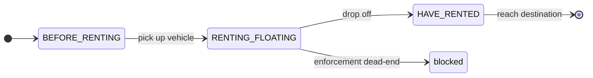
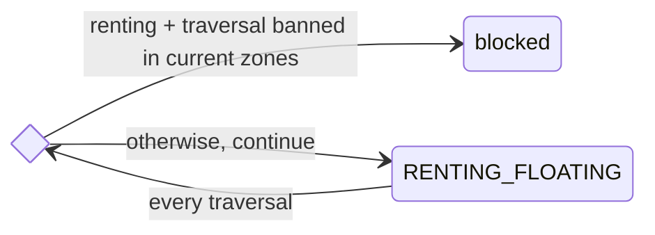
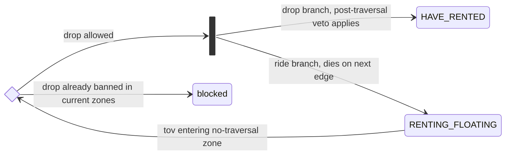
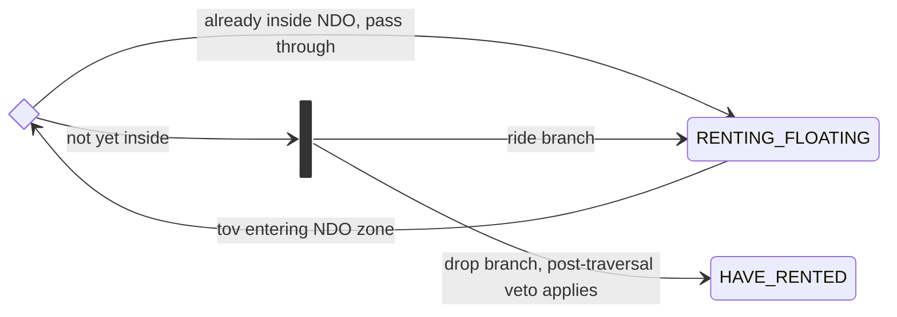
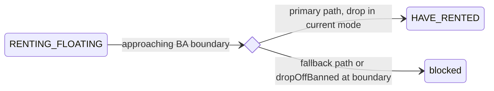
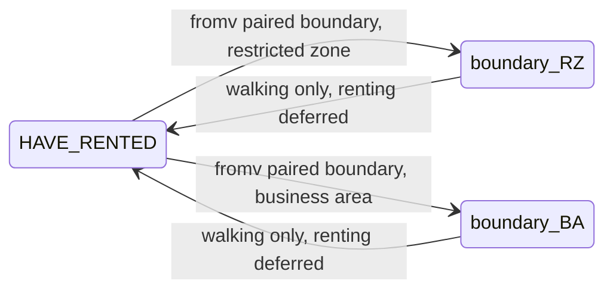
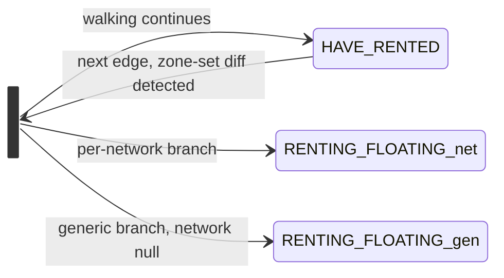
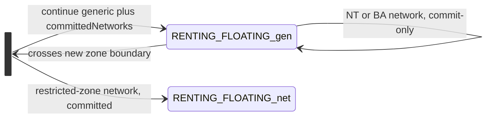
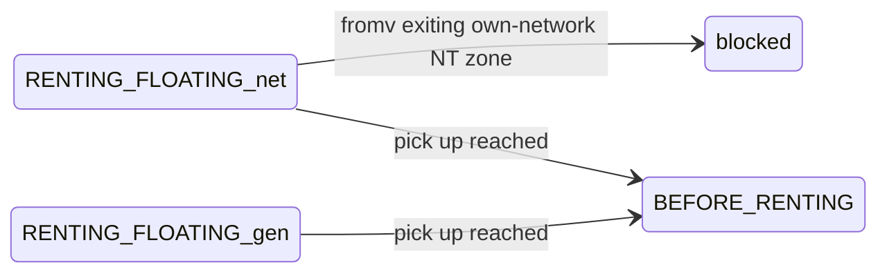

# Vehicle Rental Geofencing — State Diagrams

State diagrams for the geofencing enforcement system in
`street/src/main/java/org/opentripplanner/service/vehiclerental/street/geofencing/`.

The enforcement logic is intricate enough that one diagram per direction is unreadable.
Below: a high-level overview, then one focused sub-diagram per enforcement scenario.

## High-level rental state machine



The geofencing enforcement affects transitions involving `RENTING_FLOATING`,
`RENTING_FROM_STATION`, and `HAVE_RENTED`. `BEFORE_RENTING` is unaffected (the rider
is on foot with no vehicle, so zone restrictions don't apply).

`RENTING_FLOATING` and `RENTING_FROM_STATION` are treated differently:

- `RENTING_FLOATING`: full enforcement — forks (drop + ride), forced drops at BA
  exit, etc. The detailed scenarios below describe this case.
- `RENTING_FROM_STATION`: **block-only semantics** — the rider can't legally drop
  mid-street, so any "fork drop + ride" response collapses to `State.empty()`. See
  the [Station rentals](#station-rentals) section.

## Dispatcher overview

`GeofencingInterceptor.apply()` is the single entry point. The dispatch shape:

```
GeofencingInterceptor.apply()
  ├─ TraversalBanHandler.apply(s0)              — set-level: block renting in NT-banned zones (scenario 1)
  └─ if arriveBy → evaluateArriveBy
       ├─ DeferredForkHandler.applyDeferredFork  — committed renting fork on edge AFTER zone exit (scenario 6)
       ├─ enforcement.arriveByCrossingExit       — block committed renter exiting own NT zone (scenario 8)
       ├─ WalkerBoundaryHandler.apply            — HAVE_RENTED walker at paired boundary (scenario 5)
       └─ NetworkCommitmentHandler.apply…        — generic state crossing new-network zone (scenario 7)
     else (forward) → evaluateForward
       ├─ enforcement.forwardApproachingEntry    — fork at NT/NDO entry (scenarios 2, 3)
       ├─ enforcement.forwardApproachingExit     — drop at BA exit, primary path (scenario 4)
       └─ enforcement.forwardCrossingExit        — block at BA exit, fallback path (scenario 4)
```

`GeofencingBoundaryEnforcement` is the per-zone strategy interface. `forZone(zone)` returns
`BusinessAreaEnforcement` or `RestrictedZoneEnforcement`. Strategies override only the
positions they care about.

---

## Forward direction

### 1. Traversal-ban guard (set-level)

**Scenario.** A renting state is inside a traversal-banned zone — either it was
picked up there (zone in `currentGeofencingZones` at initialization) or it entered
via the ride branch of scenario 2. Fires before any boundary check.

**Why this is correct.** No legal continuation exists. The legal alternative — the
drop branch — was already produced upstream at scenario 2.

**Why a handler, not a strategy.** The check is **set-level**: it depends on the
priority-resolved view of `currentZones` for the state's network
(`isTraversalBannedByCurrentZones`), not on any one zone. That doesn't fit
per-zone `GeofencingBoundaryEnforcement` dispatch.

**Code references.**
- Entry point: `GeofencingInterceptor.java:23` → `TraversalBanHandler.apply(s0)`
- Block condition: `TraversalBanHandler.java:19-21` — `isRentingVehicle && isTraversalBannedByCurrentZones` → `State.empty()`



### 2. Entering a no-traversal zone

**Scenario.** A rider approaches a no-traversal zone. The current edge ends at a
`tov` vertex carrying the zone's `entering=true` marker — i.e. `tov` is *outside*
the zone with an outgoing edge into it.

**Why fork.** Two legal continuations exist at the approach vertex: (a) drop the
vehicle here (outside the zone) and walk; (b) keep riding to explore routes that go
*around* the zone. The ride branch lets A* discover paths where riding around stays
cheaper than dropping and walking through. If the ride branch later takes the
boundary-crossing edge, `TraversalBanHandler` kills it (scenario 1).

**Post-traversal drop veto.** If the landing vertex is itself drop-banned (e.g. an
NDO boundary coincides with the NT entry), the drop branch is suppressed and only
the ride branch is produced.

**Station rentals.** Block — can't drop mid-street.

**Code references.**
- Dispatch (`tov.entering=true` → enforcement): `GeofencingInterceptor.java:47-58`
- Strategy entry: `RestrictedZoneEnforcement.forwardApproachingEntry` (line 25); station-rental gate at line 30, NT branch at line 36
- Fork body: `RestrictedZoneEnforcement.forwardEnteringNoTraversal` (line 92) — produces `dropState` + `rideState`
- Post-traversal veto on drop branch: `RestrictedZoneEnforcement.java:99` — `!dropEditor.isDropOffBannedByCurrentZones()`
- Block ride branch on next edge: `TraversalBanHandler` (scenario 1)



### 3. Entering a no-drop-off zone

**Scenario.** A rider approaches a no-drop-off zone (drops banned, riding allowed).

**Why fork.** Two legal continuations: drop now (still outside the zone) or ride
through. Two edge cases handled inline: (a) if already inside an NDO zone, no fork
— pass through (dropping is already banned). (b) Post-traversal veto rechecks
`isDropOffBannedByCurrentZones` on the editor and discards the drop branch if the
edge itself crossed into a drop-banned zone.

**Code references.**
- Strategy entry: `RestrictedZoneEnforcement.forwardApproachingEntry` (line 25); NDO branch at line 39
- Fork body: `RestrictedZoneEnforcement.forwardEnteringNoDropOff` (line 121)
- Pass-through if already inside: `RestrictedZoneEnforcement.java:122-124`
- Post-traversal veto on drop branch: `RestrictedZoneEnforcement.java:129`



### 4. Exiting a business area

**Scenario.** A rider approaches the edge of the operating area. The vehicle must
be returned *inside* the BA.

**Two paths depending on which vertex carries the marker.**

- **Primary** (`forwardApproachingExit`) — `tov` is inside the BA with
  `entering=false` (next edge would exit). Ride in current mode and drop at `tov`.
- **Fallback** (`forwardCrossingExit`) — the state is at the boundary vertex
  itself, with no prior edge to use the `tov` trick. Block — pure walking from the
  corresponding `BEFORE_RENTING` branch dominates a walk-and-drop alternative.

If drop is banned at the boundary (overlapping NDO), block.

**Code references.**
- Primary path dispatch: `GeofencingInterceptor.java:47-58` (toBoundaries with
  `entering=false`) → `BusinessAreaEnforcement.forwardApproachingExit` (line 27)
- Drop creation (primary): `BusinessAreaEnforcement.forwardExit` (line 72), with
  pre- and post-traversal NDO veto at lines 73 and 80
- Fallback path dispatch: `GeofencingInterceptor.java:63-76` (fromBoundaries with
  `entering=false`) → `BusinessAreaEnforcement.forwardCrossingExit` (line 45)
- Station-rental block: `BusinessAreaEnforcement.java:31-33` (primary) and the
  whole fallback (line 49 returns `State.empty()` for any renting state)



---

## Arrive-by direction

The search runs backward from destination. The walker (`HAVE_RENTED`) crosses
boundaries in reverse; the drop-off (forward time) is created *one edge after* the
boundary so the back-edge points safely outside the zone.

### 5. HAVE_RENTED walker at a zone boundary

**Scenario.** The arrive-by walker (HAVE_RENTED at start) reaches a `fromv` paired
with `tov` on a zone boundary — in forward time, the drop point.

**Why walking-only here.** Forking the rental branch at this vertex would attach
its back-edge to the boundary edge pointing *into* the zone — reversed to forward
time, the itinerary would show the drop inside the zone. Instead, produce only
walking here; the rental branch is created one edge later by `DeferredForkHandler`
(scenario 6) where the back-edge is safely outside. Applies to both restricted
zones (walker out-to-in) and business areas (walker in-to-out).

**Code references.**
- Entry point: `GeofencingInterceptor.java:116-119` → `WalkerBoundaryHandler.apply`
- Paired-boundary filter and direction logic: `WalkerBoundaryHandler.java` (XORs
  `arriveBy` with `entering` to select the correct strategy method)
- Restricted-zone walker: `RestrictedZoneEnforcement.arriveByAtBoundary` (line 75)
  — produces walking-only branch
- Business-area walker: `BusinessAreaEnforcement.arriveByAtBoundary` (line 60) —
  produces walking-only branch



### 6. Deferred renting fork (next edge after boundary)

**Scenario.** Continuing from scenario 5: the walker has just stepped across the
boundary edge and is now one edge *outside* the zone.

**Why here.** The renting branches' back-edges now point at the boundary-crossing
edge, geographically outside the zone — reversed to forward time, the itinerary
shows "drop at the edge of the zone." Three kinds of branches: (a) walking
continues; (b) one `RENTING_FLOATING_net` per network whose zone was just exited
(committed); (c) one generic `RENTING_FLOATING_gen` with `network=null` to keep
exploring uncommitted solutions. Per-network branches respect `allowedNetworks` /
`bannedNetworks` and skip networks whose NDO the walker is currently inside.

**Code references.**
- Entry point: `GeofencingInterceptor.java:88-91` → `DeferredForkHandler.applyDeferredFork`
- Trigger detection (zone-set diff): `DeferredForkHandler.isDeferredRentingForkTrigger` (line 40)
- Fork body: `DeferredForkHandler.performDeferredRentingFork` (line 70) — collects
  exited networks, produces walking + per-network + generic branches
- Network allow-list filter: `DeferredForkHandler.isNetworkAllowedByRequest` (line 163)



### 7. Generic state network commitment

**Scenario.** A generic `RENTING_FLOATING_gen` (from scenario 6, or from a
non-boundary floating-pickup vertex) crosses into a zone owned by a specific
network in arrive-by.

**Why fork.** In forward time, this is where the rider entered that network's
operating zone. A committed branch is needed so pickup-edge matching for the
network's vehicles works downstream. The generic branch also continues, with the
new network added to `committedNetworks` to suppress double-forking. Two
refinements:

- **NT networks** — commit-only (no fork). A committed branch would be killed at
  the next edge by scenario 8 anyway; recording the network prevents re-forking.
- **BA networks** — commit-only (no fork). BA committed branches are produced via
  the HAVE_RENTED walker path (scenarios 5 + 6); forking here would produce a
  path that drops outside the BA.

**Code references.**
- Entry point: `GeofencingInterceptor.java:121-123` → `NetworkCommitmentHandler.applyNetworkCommitment`
- NT zone shortcut (commit network without forking): `NetworkCommitmentHandler.collectNoTraversalNetworks` (line 52) → `commitNetworks` (line 72)
- Classification of new-zone networks (fork vs commit-only): `NetworkCommitmentHandler.classifyNewZoneNetworks` (line 95); BAs go to the commit-only set
- Fork body: `NetworkCommitmentHandler.forkCommittedBranches` (line 121) — produces committed per-network branches + continued generic



### 8. Committed state in arrive-by

**Scenario.** A committed `RENTING_FLOATING_net` reaches a `fromv` with the own
network's NT-zone marker `entering=false`. In forward time the rider would have
been *inside* this NT zone — illegal for a committed renter.

**Why block.** Forward and arrive-by are symmetric: forward catches the in-zone
state via `TraversalBanHandler` one edge inside; arrive-by catches it at the
boundary itself.

**Code references.**
- Dispatch: `GeofencingInterceptor.java:99-114` (committed renter, network match,
  fromBoundary with `entering=false`)
- Strategy: `RestrictedZoneEnforcement.arriveByCrossingExit` (line 56) — blocks on
  own-network NT zone



---

## Completeness checklist

Every plausible `(state, direction, trigger)` combination, with where it's
handled. "Pass" rows are intentional no-ops.

| State | Direction | Trigger | Handled by |
|---|---|---|---|
| `RENTING_FLOATING` | forward | inside NT zone | Scenario 1 — pickup inside zone, or ride branch of scenario 2 entered |
| `RENTING_FLOATING` | forward | tov approaching NT zone | Scenario 2 |
| `RENTING_FLOATING` | forward | tov inside NT zone (entry edge) | Ride branch from scenario 2; killed by `TraversalBanHandler` next edge |
| `RENTING_FLOATING` | forward | tov entering NDO zone | Scenario 3 |
| `RENTING_FLOATING` | forward | exiting BA | Scenario 4 |
| `RENTING_FLOATING` | forward | entering BA | Pass |
| `RENTING_FROM_STATION` | forward | any | Station-rental section below |
| `HAVE_RENTED` walker | arrive-by | fromv paired boundary | Scenario 5 |
| `HAVE_RENTED` walker | arrive-by | next edge after exit | Scenario 6 |
| `HAVE_RENTED` walker | arrive-by | at rental station vertex | `VehicleRentalEdge.dropOffRentedVehicleAtStation(reverse=true)` (outside interceptor) |
| `RENTING_FLOATING_gen` | arrive-by | crosses new zone boundary | Scenario 7 |
| `RENTING_FLOATING_net` | arrive-by | fromv exiting own-network NT zone | Scenario 8 |
| `RENTING_FLOATING_net` | arrive-by | tov in different network's zone | Pass — interceptor network filter |
| `HAVE_RENTED` walker | forward | any | Pass — `isRentingVehicle()` gate |
| `BEFORE_RENTING` walker | any | any | Pass — same gate |
| `RENTING_FROM_STATION` committed | arrive-by | fromv exiting own NT zone | Same dispatch as scenario 8 |
| Any rider | any | overlapping zones | Per-field precedence via `is*BannedByCurrentZones`, resolved before enforcement |

Generic `RENTING_FLOATING_gen` only exists in arrive-by (forward picks up with a
specific network), so forward has no generic-state scenarios.

## Station rentals

Station rentals can't legally drop mid-street. The strategies detect
`isRentingVehicleFromStation()` and use **block** instead of fork:

| Trigger | Floating | Station |
|---|---|---|
| Inside NT zone (scenario 1) | block | block |
| Forward entering NT zone | fork drop + ride | **block** (`RestrictedZoneEnforcement.java:31-33`) |
| Forward entering NDO zone | fork drop + ride | pass — `RestrictedZoneEnforcement.java:30-35` returns null |
| Forward exiting BA | drop at boundary | **block** (`BusinessAreaEnforcement.java:31-33`; fallback also blocks) |
| Forward entering BA | pass | pass |

Arrive-by needs no special branch: committed station-rental states going backward
into an NT zone are blocked by the same `arriveByCrossingExit` check (scenario 8).
Phantom `RENTING_FLOATING` branches from scenario 6 for station-only networks
propagate backward, find no floating pickup (`VehicleRentalEdge` requires
`station.isFloatingVehicle()`), and die — wasted exploration, not an illegal
itinerary.

## Two orthogonal concerns (apply to all scenarios)

- **Zone-set tracking** on `State.currentGeofencingZones` — updated at boundary
  edges in `StateEditor.updateGeofencingZones()`. `isDropOffBannedByCurrentZones` /
  `isTraversalBannedByCurrentZones` resolve overlapping zones by priority. Business
  areas are excluded from the initial set when `applyBusinessAreas` is false (see
  `GeofencingZoneApplier.preResolveVertexZones`) so a disabled BA can't mask
  restrictive zones via priority resolution.
- **Set-level traversal-ban guard** in `TraversalBanHandler.apply()`: any renting
  state inside a traversal-banned zone set returns `State.empty()`. Runs before any
  direction-specific dispatch (scenario 1).

## Related

- Architecture overview: `street/src/main/java/org/opentripplanner/service/vehiclerental/street/geofencing/package.md`
- Strategy design: `geofencing-enforcement-abstraction.md`
- Branch plan: `geofencing-fresh-branch-design.md`
